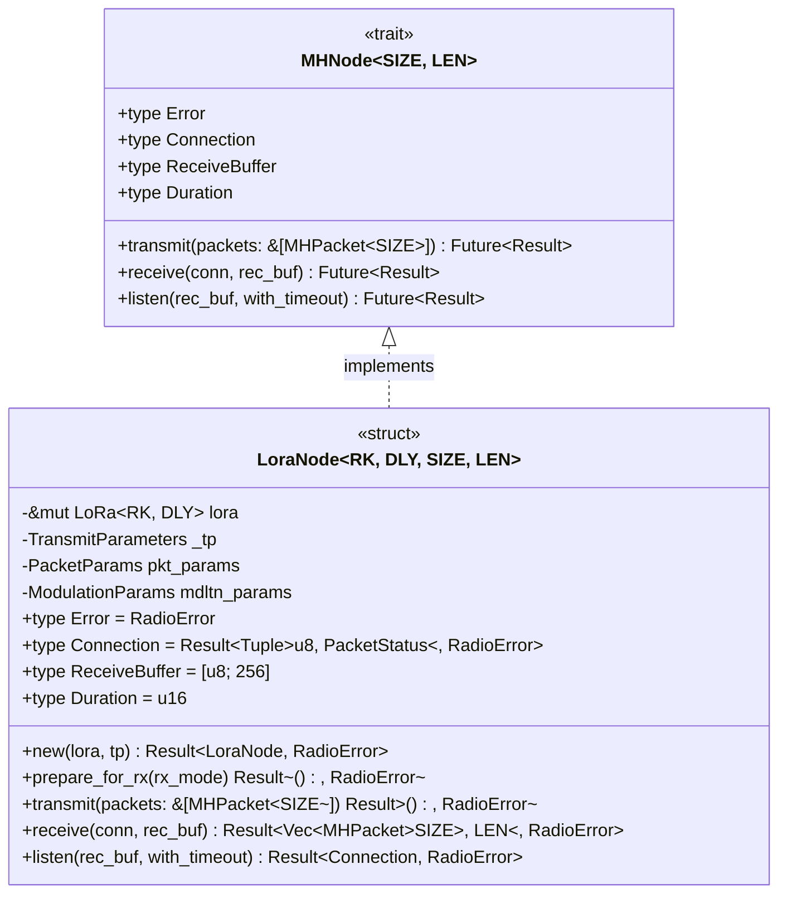
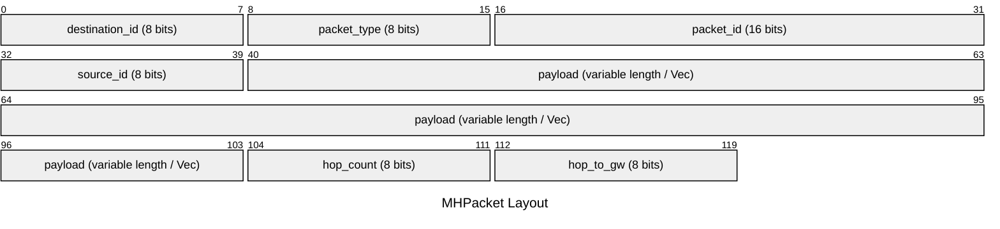
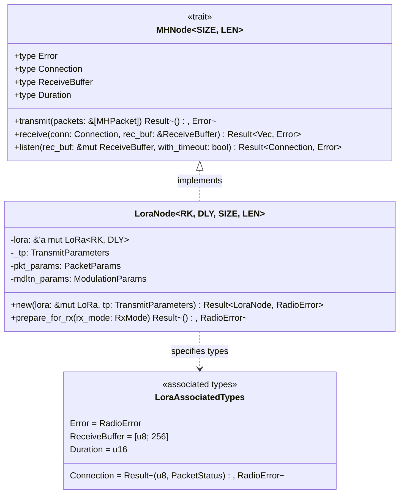

# Figures

The `MHNode` trait:

```mermaid
classDiagram
    class MHNode~SIZE, LEN~ {
        <<trait>>
        +type Error
        +type Connection
        +type ReceiveBuffer
        +type Duration
        +transmit(packets: &[MHPacket~SIZE~]) Future~Result~
        +receive(conn, rec_buf) Future~Result~
        +listen(rec_buf, with_timeout) Future~Result~
    }

    class LoraNode~RK, DLY, SIZE, LEN~ {
        <<struct>>
        -&mut LoRa~RK, DLY~ lora
        -TransmitParameters _tp
        -PacketParams pkt_params
        -ModulationParams mdltn_params

        %% Associated Types Defined
        +type Error = RadioError
        +type Connection = Result~Tuple~u8, PacketStatus~, RadioError~
        +type ReceiveBuffer = [u8; 256]
        +type Duration = u16

        +new(lora, tp) Result~LoraNode, RadioError~
        +prepare_for_rx(rx_mode) Result~(), RadioError~

        %% Trait Implementations
        +transmit(packets: &[MHPacket~SIZE~]) Result~(), RadioError~
        +receive(conn, rec_buf) Result~Vec~MHPacket~SIZE~, LEN~, RadioError~
        +listen(rec_buf, with_timeout) Result~Connection, RadioError~
    }

    MHNode <|.. LoraNode : implements
```

- `MHPacket` layout:

```mermaid
---
title: "MHPacket Layout"
---
packet-beta
0-7: "destination_id (8 bits)"
8-15: "packet_type (8 bits)"
16-31: "packet_id (16 bits)"
32-39: "source_id (8 bits)"
40-103: "payload (variable length / Vec)"
104-111: "hop_count (8 bits)"
112-119: "hop_to_gw (8 bits)"
```

- `LoraNode` implementation of `MHNode`:

```mermaid
classDiagram
    class MHNode~SIZE, LEN~ {
        <<trait>>
        +type Error
        +type Connection
        +type ReceiveBuffer
        +type Duration
        +transmit(packets: &[MHPacket]) Result~(), Error~
        +receive(conn: Connection, rec_buf: &ReceiveBuffer) Result~Vec, Error~
        +listen(rec_buf: &mut ReceiveBuffer, with_timeout: bool) Result~Connection, Error~
    }

    class LoraNode~RK, DLY, SIZE, LEN~ {
        -lora: &'a mut LoRa~RK, DLY~
        -_tp: TransmitParameters
        -pkt_params: PacketParams
        -mdltn_params: ModulationParams
        +new(lora: &mut LoRa, tp: TransmitParameters) Result~LoraNode, RadioError~
        +prepare_for_rx(rx_mode: RxMode) Result~(), RadioError~
    }

    class LoraAssociatedTypes {
        <<associated types>>
        Error = RadioError
        Connection = Result~(u8, PacketStatus), RadioError~
        ReceiveBuffer = [u8; 256]
        Duration = u16
    }

    MHNode <|.. LoraNode : implements
    LoraNode ..> LoraAssociatedTypes : specifies types
```
