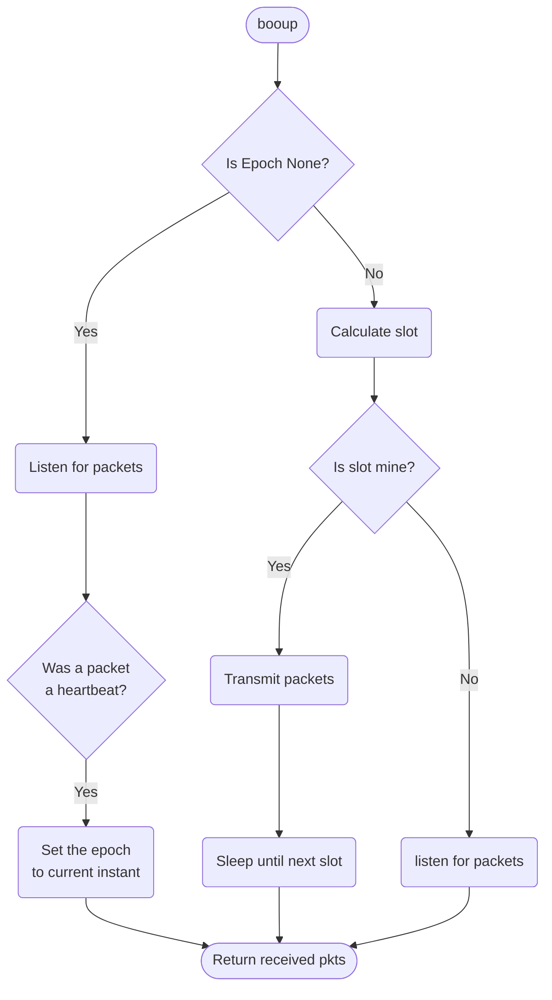

# MAC algorithmer

## Random access

```mermaid
graph TD
    Start([bootup]) --> HasTx{is tx queue empty?}

    HasTx -- No --> Tx{Transmit packets}
    Tx --> Listen

    HasTx -- Yes --> Listen(Listen with timeout)
    Listen --> ListenRes{Got packets <br> before timeout?}

    ListenRes -- Yes --> Conn{Connection okay?}
    Conn -- Yes --> Receive(Receive packets)
    Receive --> Return([Return with packets])

    ListenRes -- No --> ReturnNone([Return None])
    Conn -- No --> ReturnErr([Return conn error])

```

## TDMA

```mermaid
graph TD
    Start([booup]) --> MatchEpoch{Is Epoch None?}
    MatchEpoch -- Yes --> listenForHeart(Listen for packets)
    listenForHeart --> IsHeartbeat{Was a packet <br> a heartbeat?}
    IsHeartbeat -- Yes --> setEpoch(Set the epoch <br> to current instant)
    setEpoch --> ret([Return received pkts])

    MatchEpoch -- No --> CalcSlot(Calculate slot)
    CalcSlot --> MatchSlot{Is slot mine?}
    MatchSlot -- Yes --> Tx(Transmit packets)

    Tx --> Sleep(Sleep until next slot)
    Sleep --> ret

    MatchSlot -- No --> Rx(listen for packets)
    Rx --> ret
```
