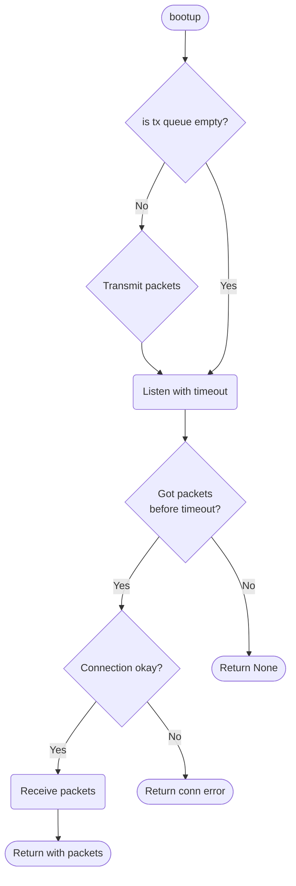
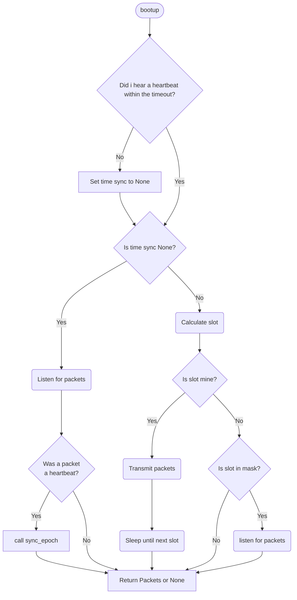

# MAC algorithmer

## Random access

```mermaid
graph TD
    Start([bootup]) --> HasTx{is tx queue empty?}

    HasTx -- No --> Tx{Transmit packets}
    Tx --> Listen

    HasTx -- Yes --> Listen(Listen with timeout)
    Listen --> ListenRes{Got packets <br> before timeout?}

    ListenRes -- Yes --> Conn{Connection okay?}
    Conn -- Yes --> Receive(Receive packets)
    Receive --> Return([Return with packets])

    ListenRes -- No --> ReturnNone([Return None])
    Conn -- No --> ReturnErr([Return conn error])

```

## TDMA

```mermaid
graph TD
    Start([bootup]) --> LastReceivedHB{Did i hear a heartbeat within the timeout?}
    LastReceivedHB -- No --> SetTimeSyncNone[Set time sync to None]
    SetTimeSyncNone --> MatchEpoch
    LastReceivedHB -- Yes -->  MatchEpoch{Is time sync None?}
    MatchEpoch -- Yes --> listenForHeart(Listen for packets)
    listenForHeart --> IsHeartbeat{Was a packet <br> a heartbeat?}
    IsHeartbeat -- Yes --> callSyncEpoch[call sync_epoch]
    callSyncEpoch --> ret[Return Packets or None]
    IsHeartbeat -- No --> ret


    MatchEpoch -- No --> CalcSlot(Calculate slot)
    CalcSlot --> MatchSlot{Is slot mine?}
    MatchSlot -- Yes --> Tx(Transmit packets)

    Tx --> Sleep(Sleep until next slot)
    Sleep --> ret

    MatchSlot -- No --> IsKnownSlot{Is slot in mask?}
    IsKnownSlot -- Yes --> Rx(listen for packets)
    IsKnownSlot -- No --> ret
    Rx --> ret
```

### `sync_epoch()` Handling a heartbeat packet

```mermaid
graph TD
    IsHeartbeat  --> IsGateway{Am i Gateway or pkt.hops_to_gw > self.hops_to_gw?}
    IsGateway -- Yes --> ClaimSlot[Add Rx slot to own mask]
    ClaimSlot --> IsTxSlotNone{Have i allocated a Tx slot?}
    IsTxSlotNone -- No --> ClaimTxSlot[Claim an available slot from senders mask]
    ClaimTxSlot --> ret([Return ])
    IsTxSlotNone -- Yes --> ret

    %% Is not GW or hops lower
    IsGateway -- No --> IsTimeSyncSet{Is time_sync set?}
    IsTimeSyncSet -- No --> SetTimeSync[Set self.time_sync]
    IsTimeSyncSet -- Yes --> FindSkew[Calculate skew from previous timestamp and instant]
    FindSkew --> SetTimeSync
    SetTimeSync --> ClaimSlot
```
