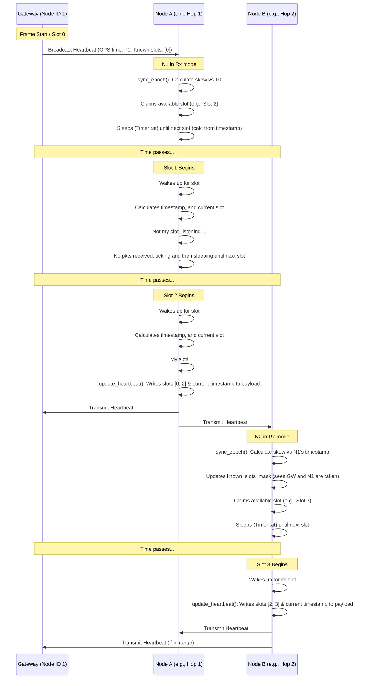
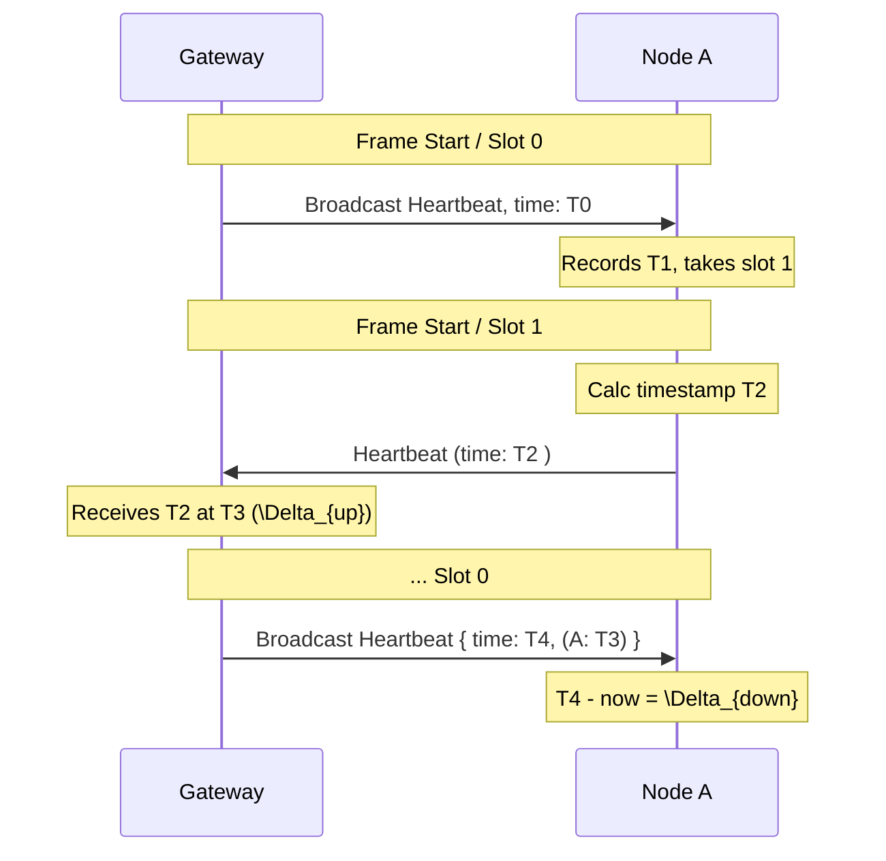
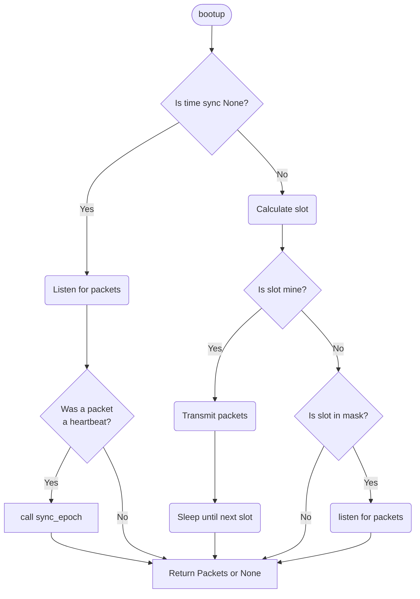
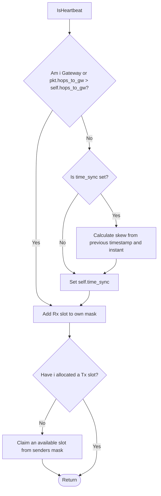

# MAC algorithmer

## Random access


## TDMA



### Time synchronization



$$
\text{delay} = \frac{\Delta_{down} + \Delta_{up}}{2}
$$

Delay is how long it takes for a message to get transmitted over the medium and be processed.

$$
\text{offset} = \frac{\Delta_{down} - \Delta_{up}}{2}
$$

Offset is the difference perceived instant at N compared to the GW.

### Calculations with `skew_ratio`

```python
# At timestamp
(old_timestamp, old_instant)
self.timestamp = heartbeat_time + offset
self.sync_instant = now()
gw_diff = self.timestamp - old_timestamp
my_diff = now() - old_instant
self.skew_ratio = gw_diff / my_diff

# At time calculation
elapsed = (now() - self.sync_instant) * self.skew_ratio
time_now = self.timestamp + elapsed

# How much sleep to reach next slot time
(time_now, slot_dur)
elapsed_in_curr_slot = time_now % slot_dur
next_slot_start = slot_dur - elapsed_in_curr_slot
node_offset = next_slot_start / self.skew_ratio
sleep_until = now() + Duration.from_millis(node_offset + guard_band(5ms))

```



### `sync_epoch()` Handling a heartbeat packet


