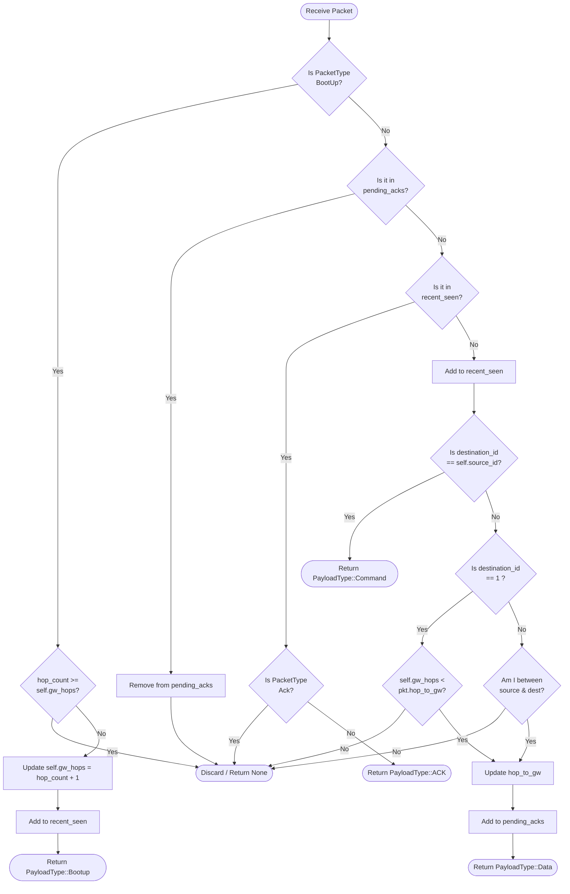
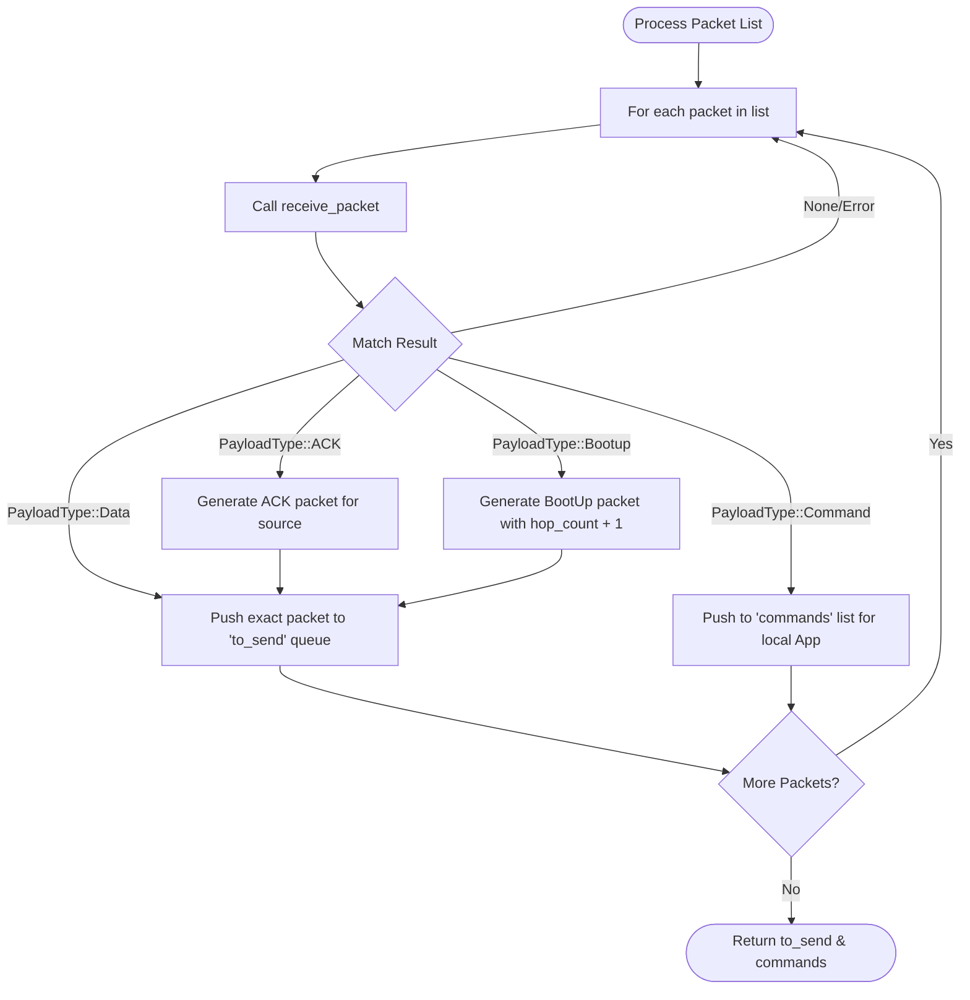

# Network Manager algorithm

`receive_packet` details the algorithm for what an endnode should do with a packet.

```mermaid
graph TD
    Start([Receive Packet]) --> IsBootup{Is PacketType <br> BootUp?}

    %% Bootup flow
    IsBootup -- Yes --> CheckBootupHop{hop_count >= <br> self.gw_hops?}
    CheckBootupHop -- Yes --> Discard([Discard / Return None])
    CheckBootupHop -- No --> UpdateGW[Update self.gw_hops = hop_count + 1]
    UpdateGW --> AddSeen1[Add to recent_seen]
    AddSeen1 --> RetBootup([Return PayloadType::Bootup])

    %% Pending ACKs check
    IsBootup -- No --> CheckPending{Is it in <br> pending_acks?}
    CheckPending -- Yes --> RemovePending[Remove from pending_acks]
    RemovePending --> Discard

    %% Duplicate / Recent Seen check
    CheckPending -- No --> CheckSeen{Is it in <br> recent_seen?}
    CheckSeen -- Yes --> IsAckType{Is PacketType <br> Ack?}
    IsAckType -- Yes --> Discard
    IsAckType -- No --> RetAck([Return PayloadType::ACK])

    %% New packet flow
    CheckSeen -- No --> AddSeen2[Add to recent_seen]
    AddSeen2 --> IsForMe{Is destination_id <br> == self.source_id?}

    %% For Me
    IsForMe -- Yes --> RetCommand([Return PayloadType::Command])

    %% Forwarding logic
    IsForMe -- No --> IsGWBound{Is destination_id <br> == 1 ?}
    IsGWBound -- Yes --> CloserToGW{self.gw_hops < <br> pkt.hop_to_gw?}
    IsGWBound -- No --> InBetween{Am I between <br> source & dest?}

    CloserToGW -- No --> Discard
    InBetween -- No --> Discard

    CloserToGW -- Yes --> PrepForward[Update hop_to_gw]
    InBetween -- Yes --> PrepForward

    PrepForward --> AddToPending[Add to pending_acks]
    AddToPending --> RetData([Return PayloadType::Data])
```

- The `handle_packets`

```mermaid
graph TD
    Start([Process Packet List]) --> Loop[For each packet in list]
    Loop --> CallReceive[Call receive_packet]
    CallReceive --> MatchResult{Match Result}

    MatchResult -- None/Error --> Loop
    MatchResult -- PayloadType::Data --> PushToSend[Push exact packet to 'to_send' queue]
    MatchResult -- PayloadType::Command --> PushToCommand[Push to 'commands' list for local App]
    MatchResult -- PayloadType::ACK --> GenAck[Generate ACK packet for source]
    MatchResult -- PayloadType::Bootup --> GenBootup[Generate BootUp packet with hop_count + 1]

    GenAck --> PushToSend
    GenBootup --> PushToSend
    PushToSend --> EndLoop{More Packets?}
    PushToCommand --> EndLoop
    EndLoop -- Yes --> Loop
    EndLoop -- No --> End([Return to_send & commands])
```
